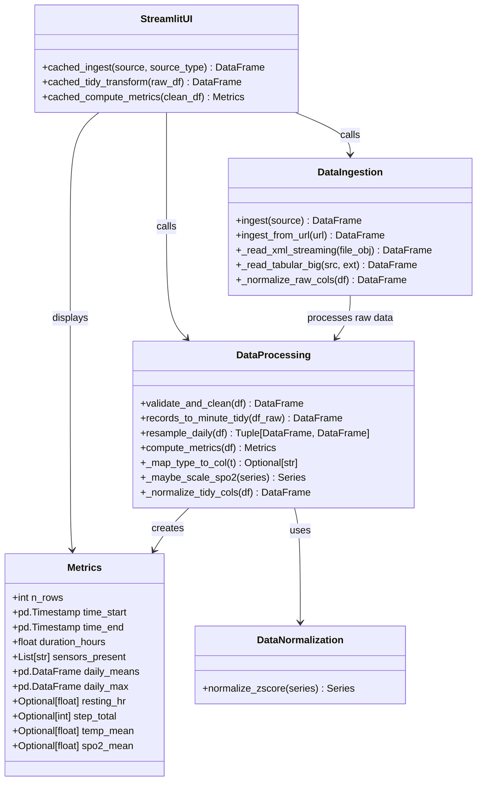
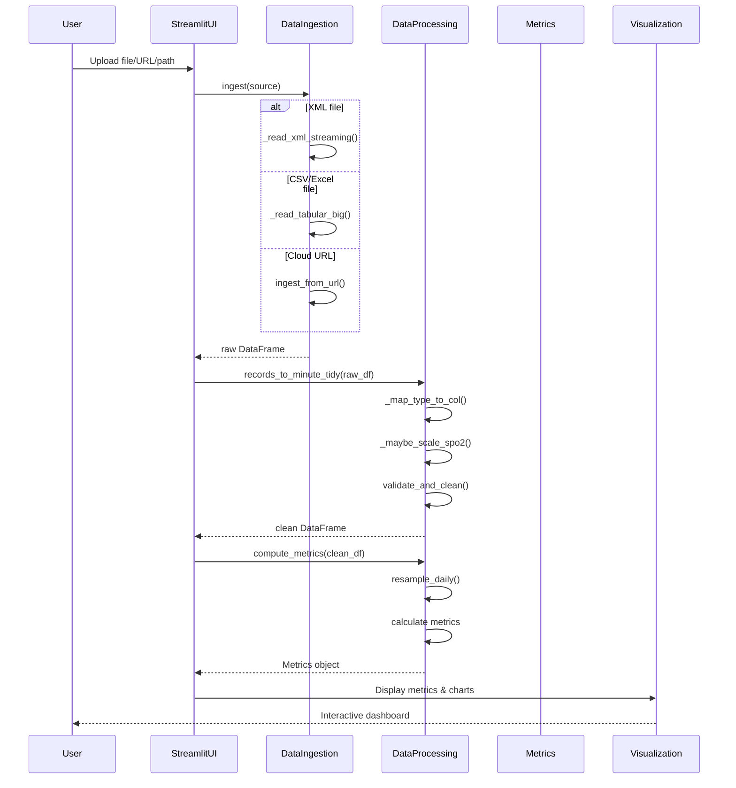

# Wearable Sensor Data Analyzer

A Streamlit-based web application for analyzing wearable sensor data from Apple Health exports and other sources. The application processes health data (heart rate, steps, temperature, oxygen saturation, etc.) and provides interactive visualizations, metrics, and data export capabilities.

## Features

- **Multi-format Data Ingestion**: Supports Apple Health XML exports, CSV files, and Excel files
- **Cloud Data Sources**: Import data from Google Drive, Dropbox, S3, and other cloud storage
- **Interactive Visualizations**: 
  - Time series charts with sensor filtering
  - Sensor comparison graphs with normalization
  - Daily averages and maximums
- **Data Processing**: 
  - Automatic data cleaning and validation
  - Per-minute aggregation
  - Daily resampling and metrics computation
- **Export Capabilities**: Download cleaned data and daily metrics as CSV

## Installation

1. Clone the repository:
```bash
git clone https://github.com/VitExMachina/Wearable_Sensor_.git
cd Wearable_Sensor_
```

2. Install dependencies:
```bash
pip install -r requirements.txt
```

3. Run the application:
```bash
streamlit run wearable_sensor_draft_code_11_03.py
```

## Usage

1. **Upload Data**: Use the sidebar to upload a file, provide a local path, or enter a cloud URL
2. **View Metrics**: The dashboard displays key metrics including total rows, duration, sensor types, and aggregated statistics
3. **Explore Visualizations**: 
   - Filter sensors in the time series view
   - Compare any two sensors with optional z-score normalization
   - View daily averages and maximums
4. **Export Data**: Download cleaned data or daily metrics as CSV files

## CI/CD Testing

This project uses **Continuous Integration (CI)** to automatically test code changes and ensure quality.

### How It Works

The CI/CD pipeline is configured using GitHub Actions and runs automatically on every code change:

```
Developer pushes code → GitHub Actions triggers → Tests run → Results reported
```

### Test Workflow

The testing workflow (`.github/workflows/tests.yml`) performs the following steps:

1. **Environment Setup**: Creates a fresh Ubuntu environment with Python 3.12
2. **Code Checkout**: Retrieves the latest code from the repository
3. **Dependency Installation**: Installs all required packages from `requirements.txt`
4. **Test Execution**: Runs all unit tests using pytest
5. **Results Reporting**: Provides pass/fail status and detailed test output

### When Tests Run

Tests automatically run in the following scenarios:

- **On every push** to the `main` branch
- **On every pull request** to the `main` branch
- **Manual trigger** via GitHub Actions UI (workflow_dispatch)

### Test Coverage

The test suite includes **47 comprehensive tests** covering:

- **Data Validation** (5 tests): Timestamp validation, sensor column recognition, data cleaning
- **Data Ingestion** (2 tests): XML parsing, CSV chunking for large files
- **Metrics Computation** (2 tests): Daily resampling, metrics calculation
- **Timezone Handling** (1 test): Timezone-aware timestamp processing
- **Comprehensive Unit Tests** (37 tests): 
  - Function validation and edge cases
  - Column normalization
  - SpO2 scaling
  - Type mapping
  - Data transformation
  - Integration scenarios

### Viewing Test Results

1. Go to the **Actions** tab in your GitHub repository
2. Click on the latest workflow run
3. View detailed test results, including:
   - Which tests passed or failed
   - Error messages and stack traces
   - Test execution time

### Benefits of CI/CD Testing

- **Early Bug Detection**: Issues are caught immediately when code is pushed
- **Quality Assurance**: Ensures all code changes maintain functionality
- **Consistent Environment**: Tests run in a clean, reproducible environment
- **Team Confidence**: Automated verification reduces manual testing burden
- **Documentation**: Test results serve as documentation of what works

### Running Tests Locally

To run tests on your local machine:

```bash
# Run all tests
pytest tests/ test_wearable_sensor_11_03.py -v

# Run specific test file
pytest tests/test_clean_validate.py -v

# Run with detailed output
pytest tests/ test_wearable_sensor_11_03.py -v --tb=short
```

### Workflow Configuration

The workflow is configured in `.github/workflows/tests.yml`:

- **Python Version**: 3.12
- **Operating System**: Ubuntu Latest
- **Test Command**: `PYTHONPATH=. pytest tests/ test_wearable_sensor_11_03.py -v --tb=short`

## Architecture & Design

This project follows a modular architecture with clear separation between data processing (backend) and user interface (frontend). The design implements software engineering best practices including test-driven development, continuous integration, and comprehensive documentation.

### System Architecture

The application follows a **Model-View-Controller (MVC)** pattern:
- **Model**: Data processing functions (`validate_and_clean`, `compute_metrics`, `resample_daily`)
- **View**: Streamlit UI components (charts, metrics display, file uploader)
- **Controller**: Streamlit app logic that orchestrates data flow between model and view

### UML Class Diagram

The following class diagram illustrates the core data structures and main functions:



### UML Sequence Diagram

The following sequence diagram shows the data flow from user input to visualization:



### Data Pipeline Flow

```
Raw Data (XML/CSV/Excel)
    ↓
[Data Ingestion Layer]
    ├─ XML Streaming Parser
    ├─ Tabular File Reader
    └─ Cloud URL Handler
    ↓
Raw DataFrame (normalized columns)
    ↓
[Data Transformation Layer]
    ├─ Type Mapping
    ├─ Per-minute Aggregation
    ├─ SpO2 Scaling
    └─ Column Normalization
    ↓
Tidy DataFrame (timestamped sensor data)
    ↓
[Data Validation Layer]
    ├─ Timestamp Validation
    ├─ Sensor Column Recognition
    ├─ Data Cleaning
    └─ Duplicate Removal
    ↓
Clean DataFrame
    ↓
[Metrics Computation Layer]
    ├─ Daily Resampling
    ├─ Statistical Calculations
    └─ Metrics Object Creation
    ↓
Metrics Object
    ↓
[Visualization Layer]
    ├─ Time Series Charts
    ├─ Sensor Comparison
    ├─ Daily Averages
    └─ KPI Cards
```

## Project Structure

```
Wearable_Sensor_/
├── wearable_sensor_draft_code_11_03.py  # Main Streamlit application
├── test_wearable_sensor_11_03.py        # Comprehensive test suite
├── tests/                                # Additional test modules
│   ├── test_clean_validate.py
│   ├── test_ingest.py
│   ├── test_metrics_resample.py
│   └── tests/
│       └── test_timezone_regression.py
├── .github/
│   └── workflows/
│       └── tests.yml                     # CI/CD workflow
├── requirements.txt                      # Python dependencies
├── Wearable_Sensor_Data_Analyzer_Project (1).pdf  # Project proposal
└── README.md                            # This file
```

## Requirements

- Python 3.12+
- streamlit >= 1.28.0
- pandas >= 2.0.0
- numpy >= 1.24.0
- altair >= 5.0.0
- requests >= 2.31.0
- openpyxl >= 3.1.0
- pytest >= 7.4.0

## Project Proposal Alignment

This project was developed as part of **MSDS 545: Introduction to Computational Software Engineering (Fall 2025)**. The implementation fulfills all requirements specified in the project proposal:

### ✅ Completed Requirements

- **Data Ingestion**: Multi-format support (XML, CSV, Excel) with cloud storage integration
- **Data Cleaning & Validation**: Comprehensive validation with error handling
- **Metric Computation**: Daily resampling, resting HR (5th percentile), step totals, temperature/SpO2 means
- **Dashboard Visualization**: Streamlit-based interactive dashboard with:
  - Time series charts with sensor filtering
  - Sensor comparison with normalization
  - Daily averages and maximums
  - KPI cards and metrics display
- **Unit Testing**: 47 comprehensive tests using pytest (Test-Driven Development)
- **CI/CD Pipeline**: GitHub Actions workflow for automated testing
- **Documentation**: Comprehensive README with UML diagrams and method documentation
- **GitHub Repository**: Version-controlled codebase with CI/CD enabled

### Key Metrics Implemented

- **Resting Heart Rate**: Calculated as 5th percentile of heart rate data
- **Step Total**: Sum of all step counts
- **Temperature Mean**: Average body temperature
- **SpO2 Mean**: Average oxygen saturation
- **Daily Averages**: Per-sensor daily mean values
- **Daily Maximums**: Per-sensor daily maximum values
- **Duration**: Time span of data collection in hours

### Methodology

The project followed an **Agile development** approach with iterative cycles:

1. **Planning**: Requirements analysis from Apple Health XML format
2. **Design**: UML diagrams (class and sequence) for system architecture
3. **Development**: Python implementation with pandas/numpy for data processing
4. **Testing**: Test-Driven Development (TDD) with pytest
5. **Deployment**: CI/CD pipeline with GitHub Actions

### Performance Optimizations

- **Streaming XML Parsing**: Handles large XML files without memory issues
- **Chunked CSV Reading**: Processes large CSV files in batches (100,000 rows)
- **Streamlit Caching**: Implements `@st.cache_data` and `@st.cache_resource` for expensive operations
- **Efficient Aggregation**: Per-minute aggregation reduces data volume while preserving information

## Method Documentation

### Core Functions

#### Data Ingestion
- `ingest(source)`: Main ingestion function supporting file objects, file paths, and cloud URLs
- `ingest_from_url(url)`: Handles cloud storage URLs (Google Drive, Dropbox, S3)
- `_read_xml_streaming(file_obj)`: Streaming XML parser for Apple Health exports
- `_read_tabular_big(src, ext)`: Chunked reader for large CSV/Excel files

#### Data Processing
- `validate_and_clean(df)`: Validates timestamps, recognizes sensor columns, removes duplicates
- `records_to_minute_tidy(df_raw)`: Transforms raw Apple Health data to per-minute tidy format
- `resample_daily(df)`: Computes daily means and maximums for all sensors
- `compute_metrics(df)`: Creates Metrics object with all computed health metrics

#### Data Normalization
- `normalize_zscore(series)`: Z-score standardization for sensor comparison
- `_maybe_scale_spo2(series)`: Scales SpO2 values if they appear as decimals (< 2)

### Testing Documentation

All functions are covered by unit tests located in:
- `test_wearable_sensor_11_03.py`: Comprehensive test suite (37 tests)
- `tests/test_clean_validate.py`: Data validation tests (5 tests)
- `tests/test_ingest.py`: Data ingestion tests (2 tests)
- `tests/test_metrics_resample.py`: Metrics computation tests (2 tests)
- `tests/tests/test_timezone_regression.py`: Timezone handling test (1 test)

See the [CI/CD Testing](#cicd-testing) section for details on running tests.

## Contributing

1. Fork the repository
2. Create a feature branch
3. Make your changes
4. Ensure all tests pass (run `pytest` locally)
5. Submit a pull request

All pull requests will automatically run the test suite before merging.

## License

[Add your license here]

## Project Team

**Course**: MSDS 545 Introduction to Computational Software Engineering  
**Semester**: Fall 2025  
**Students**: Chadric Garrick, Megan Leak, Evann Bailey, Collin Lindsay
